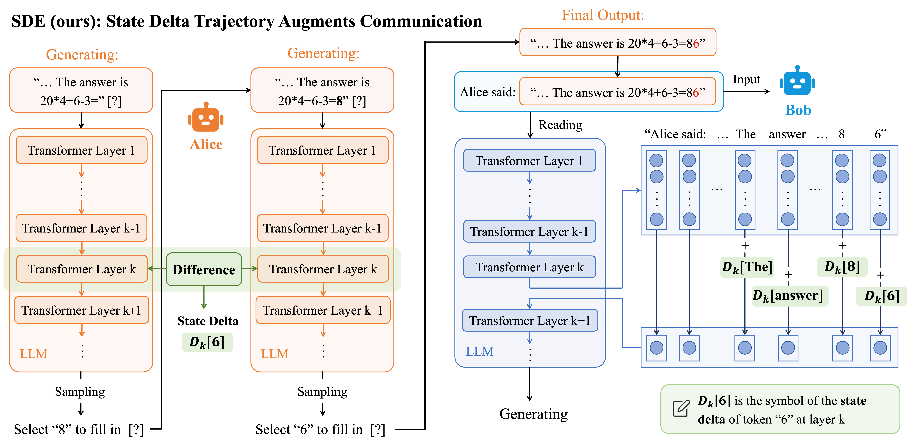

# StateDelta

Welcome to the Official Repository of State Delta Encoding (SDE)!

This repository contains the code, datasets models used in our paper: "Augmenting Multi-agent Communication with State Delta Trajectory".



## Reproduce Paper Results

### Install Environment

```bash
conda create -n SDE python=3.10.16
conda activate SDE
pip install -r requirements.txt
```

+ Update `ROOT_DIR` in `src/root_path.py` to to the folder address where you store this project.

+ Update `DATA_ROOT_PATH` in `src/root_path.py` to the dataset directory (e.g., `data/` in the current directory).

### Download Datasets

You can download the datasets used in our experiments as follows, assuming `DATA_ROOT_PATH` is `data/` in the current directory.

<details>

<summary>Quasar-T</summary>

Download the file `dev_questions.json` from the dataset link <http://curtis.ml.cmu.edu/datasets/quasar/quasar-t/questions/> and unzip it to `data/QuasarT/dev_questions.json`.

</details>

<details>
<summary>ComplexWebQuestions</summary>

Download the file `ComplexWebQuestions_dev.json` from the dataset link <https://www.dropbox.com/scl/fo/nqujvpg2gc4y0ozkw3wgr/AOzjVEsdUhv2Fx2pamfJlSw?rlkey=746t7xehfqxf1zr867nxiq8aq&e=1> and place it to `data/ComplexWebQuestions/`.

</details>

<details>
<summary>StrategyQA</summary>

Download the StrategyQA dataset with the following command:

```bash
wget -O data/strategyqa_dataset.zip https://storage.googleapis.com/ai2i/strategyqa/data/strategyqa_dataset.zip
mkdir -p data/StrategyQA
unzip data/strategyqa_dataset.zip -d data/StrategyQA
rm data/strategyqa_dataset.zip 
```

</details>

<details>

<summary>2WikiMultihopQA</summary>

Download the 2WikiMultihop dataset from its repository https://www.dropbox.com/s/ms2m13252h6xubs/data_ids_april7.zip?e=1. Unzip it and move the folder to `data/2WikiMultihopQA`.

</details>

<details>

<summary>GSM8K</summary>

Download the file `test.jsonl` from the dataset link <https://github.com/openai/grade-school-math/tree/master/grade_school_math/data>, and place it to `data/GSM8K/test.jsonl`.

</details>

<details>
<summary>MMLU</summary>

Download the MMLU dataset with the following command:

```bash
mkdir -p data/MMLU
wget -P data/MMLU https://people.eecs.berkeley.edu/~hendrycks/data.tar
tar --strip-components=1 -xvf data/MMLU/data.tar -C data/MMLU
rm data/MMLU/data.tar
```

</details>


<details>

<summary>HotpotQA</summary>

Download the HotpotQA dataset with the following command:

```bash
mkdir -p data/HotpotQA
wget -P data/HotpotQA/ http://curtis.ml.cmu.edu/datasets/hotpot/hotpot_dev_distractor_v1.json
```

</details>

<details>

<summary>FEVER</summary>

We use the FEVER 2.0 dataset for the agent workflow task. You can download the dataset with the following command:

```bash
mkdir -p data/FEVER
wget -P data/FEVER https://fever.ai/download/fever2.0/fever2-fixers-dev.jsonl 
```

</details>

### Retriever

For information asymmetry (IA) and agent workflow tasks, we use BM25 over Wikipedia for retrieval.

We provide pre-retrieved top-10 results for all IA datasets in `wikidpr_retrieval.zip`. Unzip it to `wikidpr_retrieval/` to use directly.

<details>
<summary>Optional: Build Your Own Retriever</summary>

1. Download the Wikipedia dump from the [DPR repository](https://github.com/facebookresearch/DPR/blob/main/dpr/data/download_data.py#L32) using the following command:

    ```bash
    mkdir -p data/dpr
    wget -O data/dpr/psgs_w100.tsv.gz https://dl.fbaipublicfiles.com/dpr/wikipedia_split/psgs_w100.tsv.gz
    pushd data/dpr
    gzip -d psgs_w100.tsv.gz
    popd
    ```

2. Use Elasticsearch to index the Wikipedia dump

    ```bash
    cd data
    wget -O elasticsearch-8.15.0.tar.gz https://artifacts.elastic.co/downloads/elasticsearch/elasticsearch-8.15.0-linux-x86_64.tar.gz  # download Elasticsearch
    tar zxvf elasticsearch-8.15.0.tar.gz
    rm elasticsearch-8.15.0.tar.gz 
    cd elasticsearch-8.15.0
    nohup bin/elasticsearch &  # run Elasticsearch in background
    cd ../..
    python prep_elastic.py --data_path data/dpr/psgs_w100.tsv --index_name wiki  # build index
    ```

</details>

### Run SDE

The `configs/` directory provides the base configurations used for different tasks. Specifically, `configs/sde_layer.json` gives the layers selected for each model when using the SDE method.

You can run our code using the following command:

```bash
python -m src.main \
    --config_file configs/debate.json \
    --model_name_or_path Qwen/Qwen2.5-7B-Instruct \
    --dataset gsm8k \
    --method sde
```

**Key Arguments**

| Parameter | Example/Options |
| --------- | ---------------- |
| `config_file` | Path to config file. Options: `configs/ia.json`, `configs/debate.json`, `configs/workflow.json` |
| `model_name_or_path` | Model to use, e.g., `Qwen/Qwen2.5-7B-Instruct`, `meta-llama/Llama-3.1-8B-Instruct`, `Qwen/Qwen2.5-14B-Instruct` |
| `dataset` | IA tasks: `quasart`, `cwq`, `strategyqa`<br>debate tasks: `gsm8k`, `mmlu_college_mathematics`, `mmlu_abstract_algebra`, `mmlu_formal_logic`<br>workflow tasks: `hotpotqa`, `strategyqa`, `fever` |
| `method` | our method: `sde`<br>or baselines: `single`, `nl`, `cipher` |

**Optional Parameters**

You can modify configuration files in the `configs/` directory. Below are some optional additional parameters. When these additional parameters are provided, your specified values will override the default settings in the configuration file.

| Parameter | Example/Options |
| --------- | ---------------- |
| `task_type` | `ia`, `debate`, or `workflow` |
| `rounds` | number of discussion rounds |
| `agent_cnt` | number of agents |
| `generation_setting` | decoding strategy: `default`, `greedy`(set temperature to 0 for CIPHER) |
| `max_new_tokens` | maximum number of generated tokens |
| `prompt_file` | path to prompt file, default in `prompts/` |
| `retrieval_topk` | for IA tasks, number of documents retrieved per question |
| `edit_layer_idx` | SDE layer selections, e.g., `1`, `1,2,3` |
| `output_dir` | Output directory (default: `output/`) |
| `sample` | Number of samples to use (`-1` means all) |
| `redo` | If set, re-run even if previous run not finish |

### Result

Results are stored in:

```plain
output/
└── {task_type}/
    └── {dataset}/
        └── {model_name}/
            └── {method}/
                └── {hash of parameters}/
                    ├── run_0/
                    │   ├── config.json
                    │   ├── detail.json
                    │   └── result.json
                    ├── run_1/
                    │   ├── config.json
                    │   ├── detail.json
                    │   └── result.json
                    └── ...
```

For example, running the command above produces output at: `output/debate/gsm8k/Qwen2.5-7B-Instruct/sde/{hash}/run_0/`. If `--redo` is specified, the output will be in `run_1`, `run_2`, etc. under the same hash directory.

The result directory will contain three files:

+ `config.json`: Configuration of the run
+ `detail.json`: Detailed results for each question
+ `result.json`: Summary with average scores and parameters used

The results reported in our paper are from the `average` field in `result.json`.

## Layer Selection for SDE

Our preliminary experiments are designed to identify the most suitable layers for applying SDE. The procedure is as follows:

1. Use the following command to evaluate each individual layer. For a model with $L$ layers, set `{idx}` to range from $0$ to $L-1$:

    ```bash
    python -m src.main \
        --config_file configs/ia.json \
        --model_name_or_path {model_name_or_path} \
        --dataset 2wqa \
        --method sde \
        --edit_layer_idx {idx} \
        --output_dir test_layer
    ```

2. Collect the exact match (EM) and F1 scores for each layer individually.

3. Select 1 to 3 layers with the highest combined scores as the target layers to be used in the SDE method.